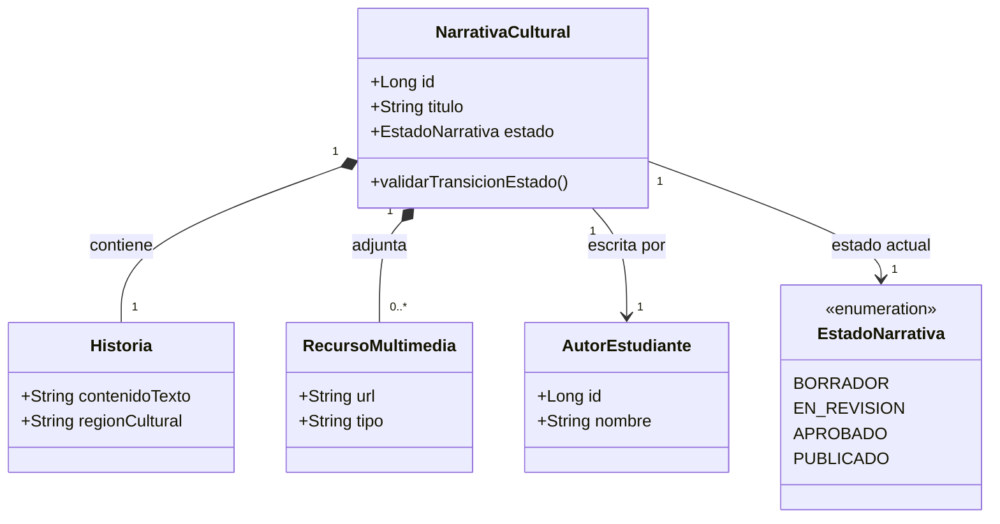

# Modelo de Dominio (Domain Driven Design)

**Objetivo:** Reconstruir las entidades centrales y reglas de negocio.

## 1. Módulo: Narrativa

### Entidades y Agregados (Aggregates)
- **`NarrativaCultural` (Agregado Raíz):** Representa la historia principal creada por el estudiante. Contiene identificadores, metadatos, estado y asocia la historia con sus recursos.
- **`AutorEstudiante` (Entidad):** Referencia al estudiante que crea la obra dentro del contexto narrativo.
- **`Historia` (Value Object / Entidad dependiente):** Estructura del contenido de la narrativa (texto, título, cultura).
- **`RecursoMultimedia` (Entidad dependiente):** Representa los archivos multimedia (imágenes generadas por IA, audios grabados vía STT) vinculados a la narrativa.

### Value Objects
- **`EstadoNarrativa` (Enum):** Define el ciclo de vida estricto de una obra: `BORRADOR`, `EN_REVISION`, `APROBADO`, `RECHAZADO`, `PUBLICADO`.

### Diagrama UML Textual (Dominio Narrativa)

## 2. Repositorios (Ports)
Dentro de la capa de dominio (`domain/port/out`), existen interfaces de repositorios que serán implementadas por la capa de infraestructura mediante Spring Data JPA. Ejemplo: `NarrativaRepositoryPort`.

## 3. Reglas de Negocio Observadas
- Una `NarrativaCultural` no puede pasar a estado `PUBLICADO` sin antes haber transitado y sido autorizada en estado `EN_REVISION` por un Docente.
- Todo recurso multimedia pertenece al ciclo de vida de la narrativa; si se borra la narrativa, sus recursos semánticamente pierden validez (Agregado).
